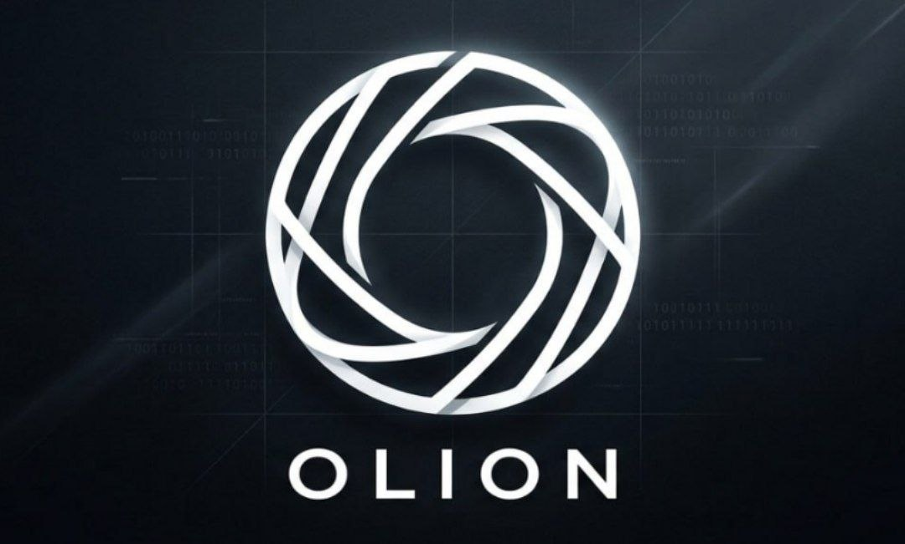
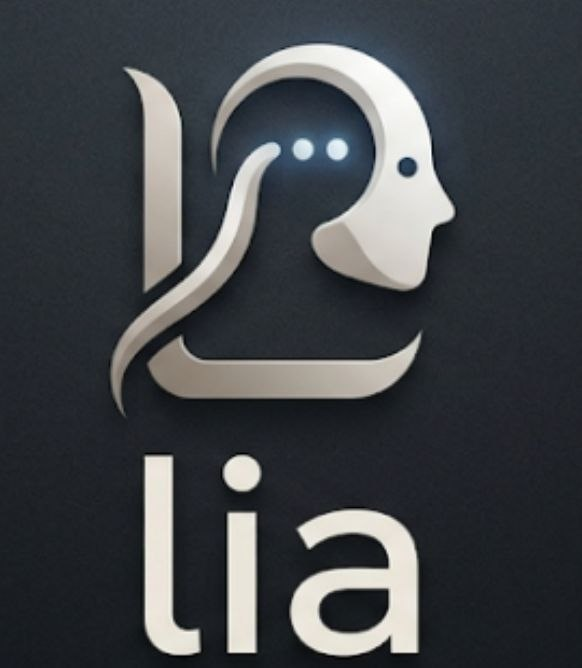
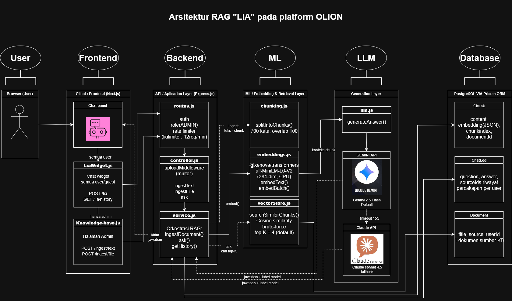
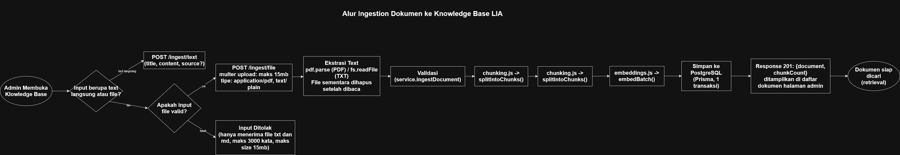
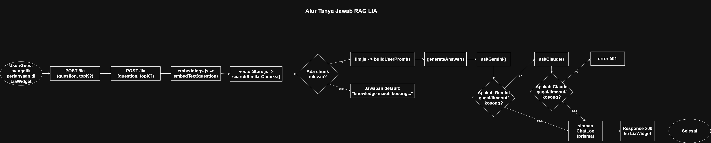
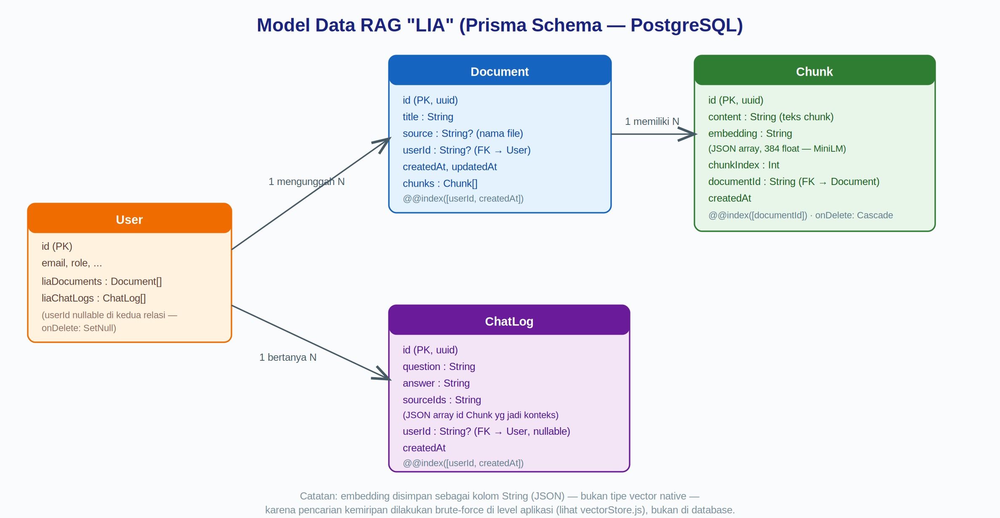

# LIA: Retrieval-Augmented Generation Chatbot untuk OLION
---
*Chatbot knowledge base berbasis **RAG (Retrieval-Augmented Generation)** yang menjawab pertanyaan pengguna forum **OLION** hanya berdasarkan dokumen internal yang telah di-ingest* oleh admin — bukan dari pengetahuan umum model bahasa.






---
Akses di [https://olion.vercel.app](https://olion.vercel.app)

| email          | password     |
| -------------- | ------------ |
| user1@olion.id | Password123! |
| user1 sd 12    | Password123! |
| mod@olion.id   | -----        |
| pakar@olion.id | -----        |
| admin@olion.id |              |

---
## Daftar Isi

- [Ringkasan](#-ringkasan)
- [Fitur Utama](#-fitur-utama)
- [Tech Stack](#-tech-stack)
- [Arsitektur End-to-End](#-arsitektur-end-to-end)
- [Alur Ingestion (Upload Dokumen)](#-alur-ingestion-upload-dokumen)
- [Alur Tanya-Jawab (Retrieval + Generation)](#-alur-tanya-jawab-retrieval--generation)
- [Model Data](#-model-data)
- [Struktur Modul & Deskripsi File](#-struktur-modul--deskripsi-file)
- [API Reference](#-api-reference)
- [Konfigurasi Environment](#-konfigurasi-environment)
- [Keterbatasan & Roadmap](#-keterbatasan--roadmap)

---

## Ringkasan

**LIA** adalah modul chatbot RAG yang tertanam di dalam backend OLION (`backend/src/modules/lia/`). Alih-alih mengandalkan pengetahuan umum LLM, LIA menjawab pertanyaan pengguna **hanya berdasarkan dokumen yang di-upload admin** ke knowledge base — menjadikannya cocok untuk FAQ, panduan komunitas, kebijakan forum, dokumentasi internal, dan pengetahuan lainnya yang di spesifikan.

Desain sistem ini menekankan **efisiensi biaya dan kesederhanaan operasional**:

- Embedding dijalankan **lokal di CPU** (tanpa API berbayar untuk tahap ini).
- Vector search dilakukan **brute-force di atas PostgreSQL biasa** (tanpa ekstensi khusus) — cukup untuk skala kecil-menengah.
- Lapisan generasi jawaban memiliki **fallback otomatis** antara dua penyedia LLM untuk menjaga ketersediaan layanan.

---

## Fitur Utama

| Fitur                  | Keterangan                                                                       |
| ---------------------- | -------------------------------------------------------------------------------- |
| Ingestion multi-format | Upload teks langsung atau file **PDF/TXT** (maks 15MB)                           |
| Smart chunking         | Potong teks 700 kata dengan overlap 100 kata agar konteks tidak terputus         |
| Local embeddings       | Model `all-MiniLM-L6-v2` (384 dimensi) via `@xenova/transformers`, jalan di CPU  |
| Semantic search        | Cosine similarity top-K terhadap seluruh chunk di database                       |
| Dual-LLM generation    | **Gemini 2.5 Flash** (utama) → fallback otomatis ke **Claude Sonnet** (cadangan) |
| Anti-halusinasi        | System prompt memaksa model menjawab *hanya* dari konteks yang diberikan         |
| Source citation        | Tiap jawaban menyertakan kutipan dokumen sumber & skor relevansi                 |
| Riwayat percakapan     | Tersimpan per user login; guest tetap bisa bertanya tanpa riwayat                |
| Kontrol akses          | Ingestion khusus `ADMIN`; endpoint tanya-jawab publik dengan rate limit ketat    |

---

## Tech Stack

| Layer | Teknologi |
|---|---|
| Frontend | Next.js, React (`LiaWidget.js`, halaman admin `knowledge-base.js`) |
| API / Backend | Express.js, Multer (upload), express-rate-limit |
| Chunking & Embedding | JavaScript custom chunker, `@xenova/transformers` (`Xenova/all-MiniLM-L6-v2`) |
| Vector Retrieval | Cosine similarity brute-force (Node.js), disimpan via Prisma |
| Database | PostgreSQL + Prisma ORM |
| LLM Generation | Google Gemini 2.5 Flash (utama), Anthropic Claude Sonnet (cadangan) |
| Ekstraksi Dokumen | `pdf-parse` untuk file PDF |

---

## Arsitektur End-to-End

Empat lapisan utama: **Client → API/Application → ML/Retrieval → Generation**, bermuara pada satu database PostgreSQL.



**Poin desain kunci:**
- Embedding lokal menghilangkan biaya per-panggilan API embedding.
- Vector store "tanpa vector database" — cukup untuk KB skala kecil-menengah, siap dimigrasi ke `pgvector` jika data bertumbuh.
- Fallback dua model LLM menambah ketahanan (*resilience*) terhadap gangguan salah satu penyedia.
- Rate limiting ketat (`12 req/menit`) pada endpoint tanya-jawab karena tiap pertanyaan memicu biaya nyata.

---

## Alur Ingestion (Upload Dokumen)

Admin dapat menambahkan pengetahuan lewat **teks langsung** atau **upload file (PDF/TXT)**. Kedua jalur bertemu pada pipeline yang sama: `validasi → chunking → embedding → simpan`.



| Tahap | Detail |
|---|---|
| Ekstraksi teks | `pdf-parse` untuk PDF, `fs.readFile` untuk TXT — file sementara selalu dihapus setelah dibaca |
| Validasi | `title` & `content` wajib diisi, maks **300.000 karakter** per dokumen |
| Chunking | 700 kata per chunk, overlap 100 kata |
| Embedding | Setiap chunk di-embed satu per satu via model MiniLM (384-dim) |
| Penyimpanan | 1 transaksi Prisma: `Document` + seluruh `Chunk` sekaligus (atomik) |

---

## Alur Tanya-Jawab (Retrieval + Generation)

Inti dari RAG: pertanyaan pengguna di-*embed*, dicocokkan ke knowledge base, lalu dijawab oleh LLM berdasarkan konteks yang ditemukan.



| Tahap           | Detail                                                                                       |
| --------------- | -------------------------------------------------------------------------------------------- |
| Retrieval       | `embedText(question)` → cosine similarity ke semua chunk → ambil **top-K = 4**               |
| KB kosong       | Jika tidak ada chunk relevan, kembalikan pesan default **tanpa memanggil LLM** (hemat biaya) |
| Prompt building | Gabungkan top-K chunk sebagai konteks + system prompt anti-halusinasi                        |
| Generation      | **Gemini** dahulu (timeout 15 detik) → fallback **Claude** jika gagal/timeout/kosong         |
| Logging         | Simpan `question`, `answer`, `sourceIds` ke `ChatLog` untuk riwayat & audit                  |

---

## Model Data

Tiga entitas inti — `Document`, `Chunk`, `ChatLog` — terhubung ke entitas `User` yang sudah ada di OLION.



> Catatan: kolom `embedding` disimpan sebagai `String` (JSON array of float), bukan tipe *vector* native — karena pencarian kemiripan dilakukan brute-force di level aplikasi, bukan di database.

---

## Struktur Modul & Deskripsi File

### Backend — Inti RAG (`backend/src/modules/lia/`)

| File | Peran |
|---|---|
| `chunking.js` | Memecah teks panjang menjadi chunk 700 kata (overlap 100) |
| `embeddings.js` | Embedding lokal (`Xenova/all-MiniLM-L6-v2`, 384 dim, singleton model) |
| `vectorStore.js` | Cosine similarity brute-force, ambil top-K chunk paling relevan |
| `llm.js` | System prompt + orkestrasi generation, fallback Gemini → Claude |
| `service.js` | Orkestrasi pipeline: `ingestDocument()`, `ask()`, `listDocuments()`, `deleteDocument()`, `getHistory()` |
| `controller.js` | HTTP layer: upload middleware (Multer), format response/error |

### Backend — Routing & Skema

| File | Peran |
|---|---|
| `backend/src/routes.js` | Mendaftarkan seluruh endpoint LIA + `liaLimiter` (12 req/menit) |
| `backend/src/config/env.js` | Memuat `ANTHROPIC_API_KEY` & `GEMINI_API_KEY` |
| `backend/prisma/schema.prisma` | Skema `Document`, `Chunk`, `ChatLog` |
| `backend/prisma/migrations/20260718100000_add_lia_rag/` | Migrasi awal fitur RAG LIA |

### Frontend

| File | Peran |
|---|---|
| `frontend/components/lia/LiaWidget.js` | Widget chat mengambang, dapat diakses semua pengguna termasuk guest |
| `frontend/pages/admin/knowledge-base.js` | Halaman admin: ingest teks/file, daftar dokumen, hapus dokumen |

---

## API Reference

| Method | Endpoint | Akses | Deskripsi |
|---|---|---|---|
| `POST` | `/ingest/text` | Admin | Ingest dokumen dari teks langsung `{ title, content, source? }` |
| `POST` | `/ingest/file` | Admin | Ingest dokumen dari upload file PDF/TXT (`multipart/form-data`) |
| `GET` | `/ingest/documents` | Admin | Daftar seluruh dokumen di knowledge base |
| `DELETE` | `/ingest/documents/:id` | Admin | Hapus dokumen beserta seluruh chunk-nya (cascade) |
| `POST` | `/lia` | Publik / Guest | Ajukan pertanyaan `{ question, topK? }` — rate limit 12 req/menit |
| `GET` | `/lia/history` | User login | Ambil riwayat percakapan (`?limit=`, maks 50) |

**Contoh response `POST /lia`:**
```json
{
  "id": "chatlog-uuid",
  "answer": "Jawaban berdasarkan knowledge base...",
  "model": "gemini",
  "sources": [
    {
      "documentTitle": "Panduan Komunitas",
      "excerpt": "Potongan teks relevan...",
      "score": 0.842
    }
  ]
}
```

---

## Konfigurasi Environment

| Variabel | Wajib | Keterangan |
|---|---|---|
| `DATABASE_URL` | ✅ | Connection string PostgreSQL |
| `GEMINI_API_KEY` | ⚠️ | Model **utama** LIA — dari [Google AI Studio](https://aistudio.google.com/apikey) |
| `ANTHROPIC_API_KEY` | ⚠️ | Model **cadangan** LIA — dari [Anthropic Console](https://console.anthropic.com) |

> Minimal salah satu dari `GEMINI_API_KEY` atau `ANTHROPIC_API_KEY` harus diisi agar LIA dapat menjawab pertanyaan. Jika keduanya kosong, endpoint `/lia` akan mengembalikan HTTP `503`.

---

## Keterbatasan & Roadmap

**Keterbatasan saat ini:**
- Retrieval brute-force men-*scan* seluruh tabel `Chunk` — berpotensi jadi bottleneck di skala besar.
- Chunking berbasis jumlah kata, belum mempertimbangkan batas kalimat/paragraf.
- Belum ada tahap *reranking* maupun evaluasi kualitas jawaban otomatis (mis. RAGAS).

**Rencana peningkatan:**
- [ ] Migrasi vector store ke **pgvector** dengan indeks ANN (HNSW/IVFFlat)
- [ ] Chunking semantik berbasis struktur dokumen
- [ ] Tambahkan lapisan **reranking** (cross-encoder) sebelum top-K final
- [ ] Pipeline evaluasi RAG otomatis (faithfulness, context recall)
- [ ] Observability: latensi per tahap & tingkat penggunaan fallback Claude

---

<p align="center"><sub>Modul Internal OLION — didokumentasikan untuk Tugas Akhir Matakuliah Artificial Intelligence.</sub></p>
